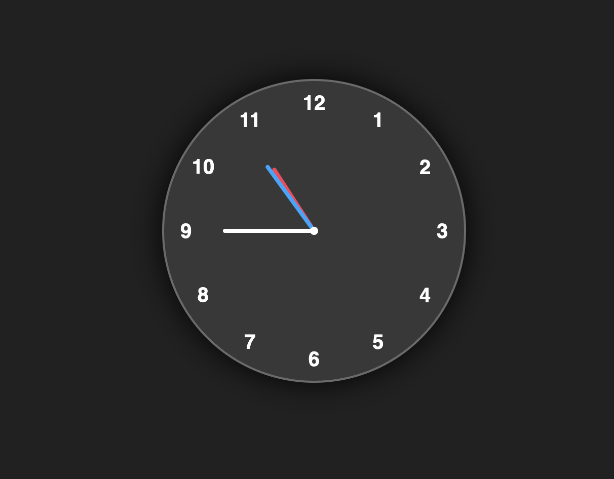

# 🕐 Analog Clock

A beautifully designed analog clock built with pure HTML, CSS, and JavaScript. Features a dark glassmorphism UI with color-coded clock hands that update every second in real time.


---

## ✨ Features

- Live real-time clock — updates every second using `setInterval`
- Three color-coded hands:
  - 🔴 **Hour hand** — Red (`#ff3d58`)
  - 🔵 **Minute hand** — Blue (`#00a6ff`)
  - ⚪ **Second hand** — White (`#ffffff`)
- Clock numbers (1–12) positioned using CSS custom properties and rotation
- Glassmorphism-style dark UI with subtle glow and transparency
- Fully centered layout — works on all screen sizes

---

## 🛠️ Tech Stack

| Technology | Purpose |
|------------|---------|
| HTML5 | Clock structure and hand elements |
| CSS3 | Circular layout, hand positioning, glass effect |
| JavaScript (Vanilla) | Real-time time calculation and hand rotation |

---

## 📁 Project Structure

```
Analog-Clock/
├── index.html    # Clock layout — hands and number spans
├── style.css     # Circular design, glassmorphism, CSS variables
└── script.js     # Reads system time and rotates hands every second
```

---

## 🚀 How to Run

No installation or build tools needed!

1. **Clone or download** this repository
2. **Open `index.html`** in any modern web browser
3. The clock starts ticking immediately!

```bash
# Optional: Clone via git
git clone https://github.com/mahfooz091/Analog-CLock.git
cd Analog-CLock
```

---

## 🖥️ How It Works

### HTML (`index.html`)
- Three `.hand` divs represent the **hour**, **minute**, and **second** hands
- Each hand uses CSS custom properties (`--clr` for color, `--h` for height) to control its appearance
- Twelve `<span>` elements display the clock numbers (1–12), each with a `--i` variable used for rotation

### CSS (`style.css`)
- The `.clock` is a circular `300×300px` element with a frosted glass look
- Each `<span>` is rotated by `30deg × --i` to position numbers around the clock face
- The `<b>` inside each span is counter-rotated so the number stays upright
- Each `.hand i` is a colored bar whose height is controlled by the `--h` CSS variable
- A `::before` pseudo-element creates the small center dot

### JavaScript (`script.js`)
- Runs `displayTime()` every **1000ms** using `setInterval`
- Gets the current hours, minutes, and seconds from `new Date()`
- Calculates rotation angles:
  - **Hour:** `30 × hours + minutes / 2` (smoothly moves between hours)
  - **Minute:** `6 × minutes`
  - **Second:** `6 × seconds`
- Applies rotation via `element.style.transform = rotate(Xdeg)`

#### Rotation Formula Explained

```
Full circle = 360°, divided by 12 hours → 30° per hour
Full circle = 360°, divided by 60 mins  →  6° per minute
Full circle = 360°, divided by 60 secs  →  6° per second

Hour hand also moves slightly with minutes:
  hRotation = 30 × hours + minutes / 2
```

---

## 🎨 Design Details

| Element | Style |
|---------|-------|
| Background | Dark `#212121` |
| Clock face | `rgba(255,255,255,0.1)` with glass border |
| Clock shadow | `0px 0px 30px rgba(0,0,0,0.9)` |
| Center dot | White circle using `::before` pseudo-element |
| Font | Sans-serif, white |

---

B.Tech Computer Science | Parul University  
• [LinkedIn](https://linkedin.com/in/mahfooz-alam-400930269/)
